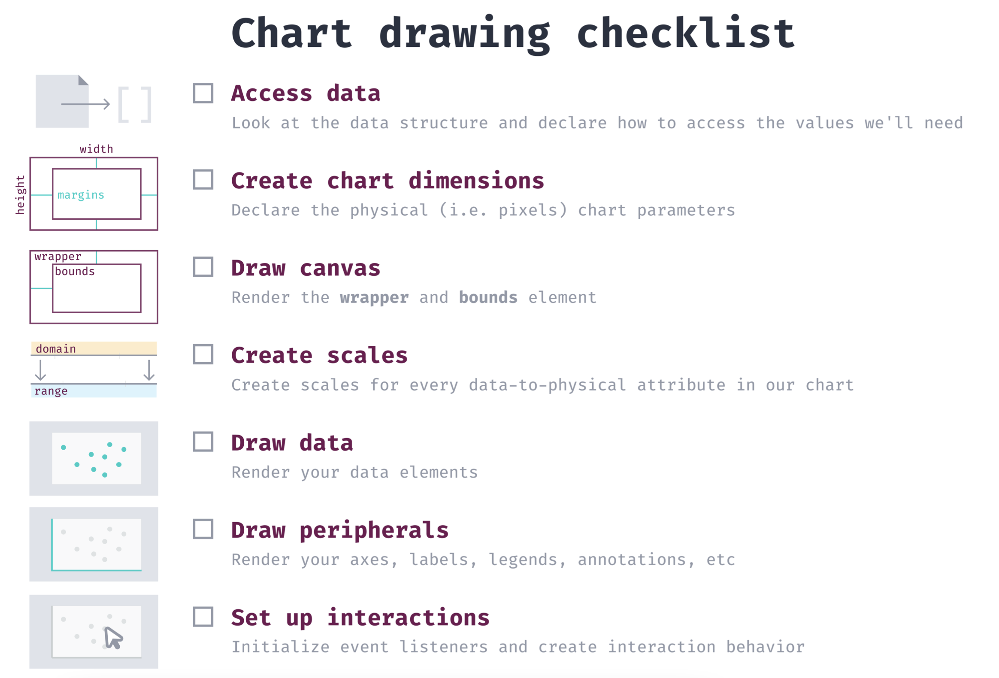
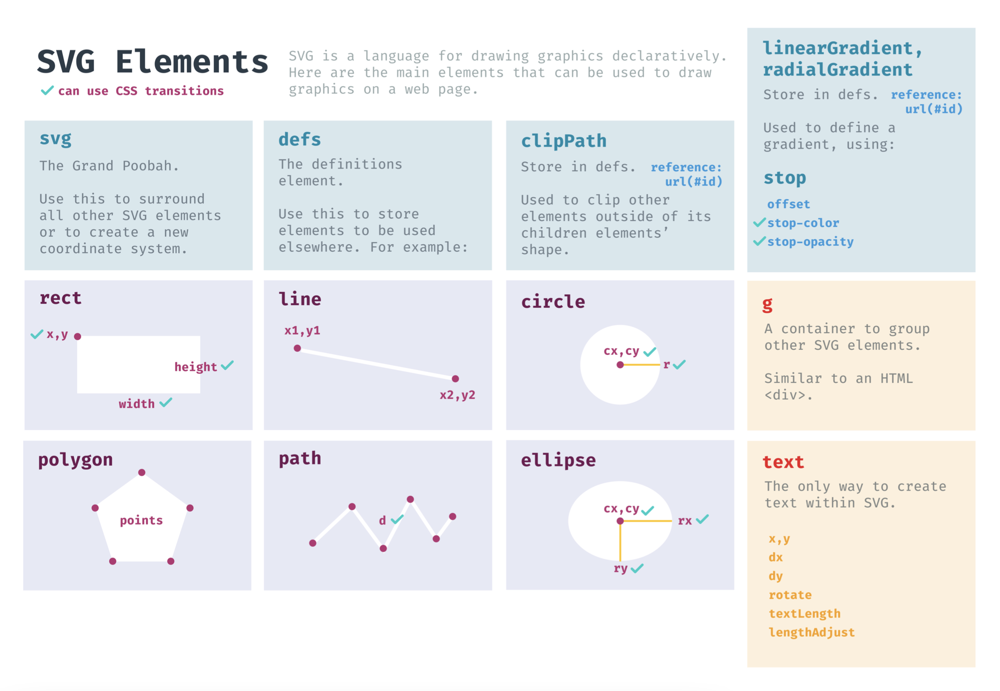

# 2022年3月

## 前言

好久没有写了，去年太忙了，都是在做需求，没有时间整理，其实也不是完全没有时间，只是没有把这件事情当做第一优先级来做，所以就耽搁了。但是"实迷途其未远"，从新开始吧。

自己心里有好几件事情想要去做，但都还没有如愿，记录于此：

1. 学习中文语法知识。时长被"的"、"地"所困扰，一直不理解其使用方式，网上讲的也模棱两可，所以需要对中文语法进行学习，以期彻底吃透这两个字的正确使用方式，并且期望对于自己文笔有所提高。但这是一个漫长的过程，不是一蹴而就的，长期坚持下去。

2. 用可视化做一个烟花。过年的时候最喜欢看烟花了，所以期望用three.js实现烟花效果，年前的时候找到过一个挺好的例子，希望能在其基础上实现自己想要的效果。[例子](https://qake.se/fw/index.html)

3. 做中国近代史的可视化。用类似地图层级的方式展开，第一层展示标题，第二层展示大纲，第三层展示细节等，还没有做调研，不知道是否有这样的实现。难点：技术实现和数据收集。

4. 文档迁移到 gitee。最近国际局势风云变换，以美国为首的西方构建的价值体系不断地被他们的各种操作证明：只要有利于他们，各种下三滥的手段都能够用上。美国最近拉拢一众企业制裁俄罗斯，包括但不限于苹果、谷歌、微软等，所以不得不防一手，万一哪天微软宣布github对中国用户关闭，也不要太过于惊讶。美国的政客真的是蠢到家了，自己构建的体系被自己的失信而一点点蚕食，早晚有崩塌的一天，我们拭目以待。

## 2022.03.09

### 使用 D3 绘制一张图表的步骤

使用D3画一个图标的步骤：



下面对其做详细解释：

#### 第一步：接入数据

这一步的目的主要是对数据结构进行分析，指定我们希望展示的值。

比如有这样的一组数据：

```javascript
const data = [
  {
    "time": 1526886000,
    "summary": "Mostly cloudy until evening.",
    "icon": "partly-cloudy-day",
    "sunriseTime": 1526905559,
    "sunsetTime": 1526960941,
    "moonPhase": 0.23,
    "precipIntensity": 0,
    "precipIntensityMax": 0,
    "precipProbability": 0,
    "temperatureHigh": 68.8,
    "temperatureHighTime": 1526947200,
    "temperatureLow": 51.61,
    "temperatureLowTime": 1526990400,
    "apparentTemperatureHigh": 68.8,
    "apparentTemperatureHighTime": 1526947200,
    "apparentTemperatureLow": 51.61,
    "apparentTemperatureLowTime": 1526990400,
    "dewPoint": 48.35,
    "humidity": 0.67,
    "pressure": 1017.72,
    "windSpeed": 3.33,
    "windGust": 6.82,
    "windGustTime": 1526950800,
    "windBearing": 325,
    "cloudCover": 0.58,
    "uvIndex": 7,
    "uvIndexTime": 1526932800,
    "visibility": 9.59,
    "temperatureMin": 52.45,
    "temperatureMinTime": 1526907600,
    "temperatureMax": 68.8,
    "temperatureMaxTime": 1526947200,
    "apparentTemperatureMin": 52.45,
    "apparentTemperatureMinTime": 1526907600,
    "apparentTemperatureMax": 68.8,
    "apparentTemperatureMaxTime": 1526947200,
    "date": "2018-05-21"
  },
  {
    "time": 1526972400,
    "summary": "Clear throughout the day.",
    "icon": "clear-day",
    "sunriseTime": 1526991898,
    "sunsetTime": 1527047412,
    "moonPhase": 0.27,
    "precipIntensity": 0,
    "precipIntensityMax": 0,
    "precipProbability": 0,
    "temperatureHigh": 75.67,
    "temperatureHighTime": 1527033600,
    "temperatureLow": 54.07,
    "temperatureLowTime": 1527080400,
    "apparentTemperatureHigh": 75.67,
    "apparentTemperatureHighTime": 1527033600,
    "apparentTemperatureLow": 54.07,
    "apparentTemperatureLowTime": 1527080400,
    "dewPoint": 50.44,
    "humidity": 0.64,
    "pressure": 1013.35,
    "windSpeed": 3.69,
    "windGust": 7.3,
    "windGustTime": 1527030000,
    "windBearing": 330,
    "cloudCover": 0,
    "uvIndex": 9,
    "uvIndexTime": 1527019200,
    "visibility": 9.84,
    "temperatureMin": 51.61,
    "temperatureMinTime": 1526990400,
    "temperatureMax": 75.67,
    "temperatureMaxTime": 1527033600,
    "apparentTemperatureMin": 51.61,
    "apparentTemperatureMinTime": 1526990400,
    "apparentTemperatureMax": 75.67,
    "apparentTemperatureMaxTime": 1527033600,
    "date": "2018-05-22"
  }
]
```

我们需要取出这组数据的`temperatureMax`和`date`，可以定义如下两个函数作为访问器：

```javascript
const dateFormatString = "%Y-%m-%d"
const dateParser = d3.timeParse(dateFormatString)
const xAccessor = d => dateParser(d.date)
const yAccessor = d => d.temperatureMax
```

其中`xAccessor`和`yAccessor`就是两个访问器，通过这两个访问器，就可以获取到想要的值。accessor并不是D3的概念，只不过是在实现图表的过程中，需要多次用到这样的逻辑，所以将其抽出，使代码更容易维护。

#### 第二步：定义图表的空间参数

图表空间主要包括两部分：`wrapper`和`bounds`。

`wrapper`指的是所有的`SVG`元素，包括坐标轴、数据元素和图例等。
`bounds`在`wrapper`内部，比`wrapper`要小，只包括数据元素。

定义空间参数就是定义`wrapper`和`bounds`的大小，而`bounds`的大小不是直接指定的，而是根据其边缘宽度计算而来，这样不仅知道了`bounds`的大小，而且知道了其相对于`wrapper`的位置。

下面看一张示意图，来加深理解：


代码实现如下：

```javascript
let dimensions = {
  width: window.innerWidth * 0.9,
  height: 400,
  margin: {
    top: 15,
    right: 15,
    bottom: 40,
    left: 60,
  },
}
dimensions.boundedWidth = dimensions.width - dimensions.margin.left - dimensions.margin.right
dimensions.boundedHeight = dimensions.height - dimensions.margin.top - dimensions.margin.bottom
```

#### 第三步：绘制`wrapper`和`bounds`

先把主体轮廓绘制出来，再绘制细节，代码实现如下：

```javascript
  const wrapper = d3.select("#wrapper")
    .append("svg")
      .attr("width", dimensions.width)
      .attr("height", dimensions.height)

  // 使用 g 元素来包裹里面的元素，从而一次性实现坐标转换
  // 可以把 g 元素当做 div，此时的g元素渲染出来的是一个 0*0 的元素，它的大小是根据里面的内容撑开的
  const bounds = wrapper.append("g")  
    .style("transform", `translate(${
      dimensions.margin.left
    }px, ${
      dimensions.margin.top
    }px)`)
```

这里需要注意`.attr()`和`.style()`函数，前者可以设定元素的属性，后者可以设定元素的内联css值，这里内联css值要比元素属性的优先级高。

#### 第四步：绘制比例尺

**比例尺**是D3中非常重要的概念，它的作用是将真实数据映射为画布上的像素值。

比如我们要把`[0, 100]`范围的真实数据映射为`[200, 100]`范围的像素值，可以如下定义

```javascript
const scale = d3.scaleLinear()
  .domain([0, 100])
  .range([200, 100])   
```

其中，`scale`是一个函数，比如现在我们有个数据为`55`，要想知道其对应的像素值，就可以做如下计算：

```javascript
const pixelValue = scale(55);
console.log(pixelValue); // -> 145
```

#### 第五步：绘制数据图形

这一步我需要往刚才定义的bounds里绘制我们需要的图形了，可以绘制各种各样svg支持的图形，由于每种图形都对应着不同的属性，为方便查阅，整理如下图片：



以折线图为例，我们可以做如下操作：

```javascript
  const lineGenerator = d3.line() // Creates a generator that converts data points into a d string
    // Transform our data point with the appropriate accessor and the scale to get the scaled value in pixel space
    .x(d => xScale(xAccessor(d)))
    .y(d => yScale(yAccessor(d)))

  const line = bounds.append("path")
    // Feed our dataset to our line generator function
    .attr("d", lineGenerator(dataset))
    // SVG elements default to a black fill and no stroke; which gives us a filled in shape unless we add styling
    .attr("fill", "none")
    .attr("stroke", "#af9358")
    .attr("stroke-width", 2)
```

当然这里面有很多细节需要注意，这需要在实现的过程中再深入进去，这里不做过多阐述

#### 第六步：绘制配件

配件主要包括坐标轴、标签、图例等，以坐标轴为例：

```javascript
  // Draw y axis tick marks and labels
  const yAxisGenerator = d3.axisLeft()  // We want labels of the y-axis to be to the left of the axis line
    .scale(yScale)
  // Our axis generator will create lots of element; create a g element to contain them and keep our DOM organized
  const yAxis = bounds.append("g").call(yAxisGenerator)

```

#### 第七步：设置交互

这一步需要做一些事件的监听等操作。

以上就是使用D3绘制一张图表的步骤，遵循此步骤，就可以使你有条不紊地绘制出一张你想要可视化的图。
