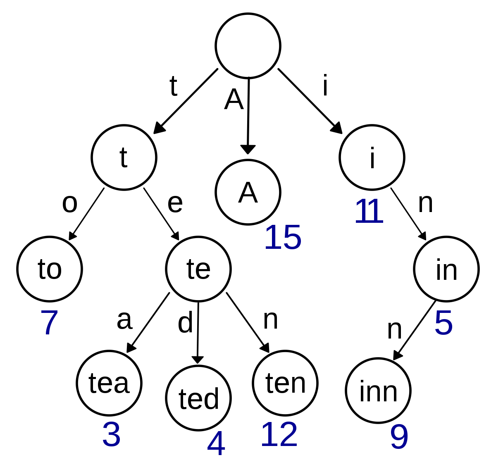
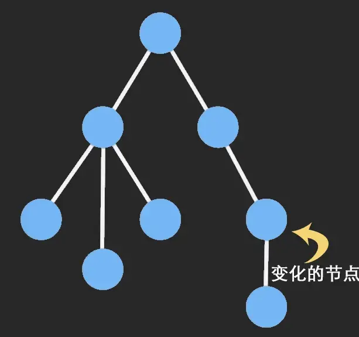

# 2021年6月

5月悄悄飘走，6月也接近尾声，时间，你慢些走~

## Trie 树

Trie (可以读try) 树又叫字典树，是一种多叉树结构。



特性：

- 根节点不包含字符，除根节点外的每一个子节点都包含一个字符
- 从根节点到某一个节点，路径上经过的字符连接起来，为该节点对应的字符串
- 每个节点的所有子节点包含的字符互不相同

优点：

- 插入/查询效率高(O(m))，其中 m 是插入/查询字符串的长度

缺点：

- 空间消耗大
- 查询效率可能会低于哈希表

应用：

- 字符串检索
- 词频统计
- 字符串排序
- 前缀匹配
- 作为其他数据结构和算法的辅助结构

参考：

[Trie 树](https://blog.csdn.net/lisonglisonglisong/article/details/45584721)

## Immutable 数据结构

看了好久有关 Immutable data 的文章，大多数的掘金文章说实在的质量都不咋地，发了文章也不校对，错别字连篇，内容上也没有深意，可能这就是内卷吧，无处不内卷。。。

Immutable Data 兴起于函数式编程，它的主要特性就是对象不可变，也就是建立一个 Immutable Data 之后，这个数据就不会改变了，你对这个数据做任何更改，都会产生一个新的数据，老的数据不会变。

为了优化内存占用，采用结构共享的方式，采用的底层数据结构类型是 `Trie` 树。

例子：

```javascript
const { Map } = require('immutable');
const map1 = Map({ a: 1, b: 2, c: 3 });
const map2 = map1.set('b', 50);
map1.get('b') + " vs. " + map2.get('b'); // 2 vs. 50
```

图片展示：



## js runtime

看了一篇掘金文章，里面包含着运行时、运行时环境、webpack runtime、runtime等，瞬间就给我整蒙了，我不知道它文章里面的运行时到底指的是啥，到底指的是所执行的js代码，还是执行js时候的环境，还是其他什么东西？

平时讨论的时候也会犯这样的毛病，本身就对这个概念理解不深，还拿出来用，在这样的情况下，沟通效果能好么？

然后我就打算把 js runtime 整明白了，但是很遗憾，没有找到官方解释，先贴几个链接

[What is javascript runtime..? [duplicate]](https://stackoverflow.com/questions/30838412/what-is-javascript-runtime)

> Javascript runtime refers to where your javascript code is executed when you run it. That said, javascript can be executed on google chrome, in which case your javascript runtime is v8, if on mozilla - it is spidermonkey, if IE - then its chakra and if on node, again its v8.

翻译一下：

> Javascript 运行时指的是执行 javascript 代码的地方。也就是说，如果 javascript 代码在 chrome 上执行，则 javascript 运行时指的是 V8，如果运行在 mozilla，则运行时指的是 spidermonkey，如果运行在IE上，则运行时只得是 chakra，如果运行在 node 上，则运行时指的是 V8。

这个回答想要告诉我们，运行时指的是一个地方。

[What is the difference between JavaScript Engine and JavaScript Runtime Environment](https://stackoverflow.com/questions/29027845/what-is-the-difference-between-javascript-engine-and-javascript-runtime-environm)

> Unlike C and other compiled languages, Javascript runs in a container - a program that reads your js codes and runs them. This program must do two things
>
> - parse your code and convert it to runnable commands
> - provide some objects to javascript so that it can interact with the outside world.
>
> The first part is called Engine and the second is Runtime.
>
> For example, the Chrome Browser and node.js use the same Engine - V8, but their Runtimes are different: in Chrome you have the window, DOM objects etc, while node gives you require, Buffers and processes.

懒得翻译了，简而言之，这个回答比上面回答的更细一些，这里对于运行时的解释是：运行代码的容器里有两部分，有一部分负责提供一些对象从而使 javascript 可以与外界交互。

看了上面两个问题，以及其他没有粘贴到此文的文章，似乎答案越来越明显了：

**所谓运行时，指的是一个环境，或者干脆点来说是一系列的代码包，这些代码包可以辅助js执行，从而使js执行的时候实现某些功能。**

有了这样的解释之后，回忆以前对于运行时的理解，其实更加准确的叫法应该是"javascript 运行的时候"，而不应该叫运行时。
