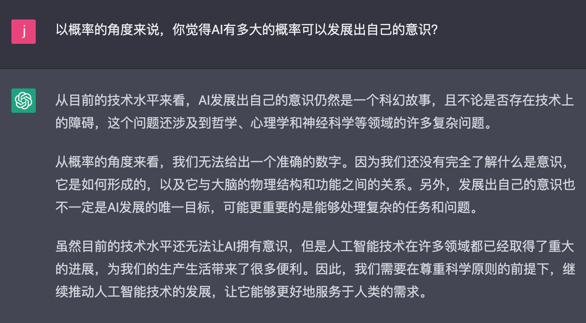

# 杂记

## 试用 `chatGPT` 的感受

`chatGPT`火了也有一段时间了，昨天终于注册了个`openAI`的账号试用了一下，给我带来了震撼的同时，也发现了一些不足。

### chatGPT 特点

目前`chatGPT`使用的是2021.9月的版本，所提供的能力是对话聊天，或者说你问它答，有点类似于搜索引擎。在摸索的过程中，发现其与搜搜引擎有两方面本质的区别：

1. `chatGPT`可以`生产`内容，而搜索引擎只能提供链接。chatGPT会根据其训练的资源和你的问题，整合信息，产出对于问题的回答；搜索引擎只会根据`seo`相关信息进行关键字检索，将检索到的资源推送给你，让你自己整合信息。

2. `chatGPT`可以以对话的方式进行提问，能够进行语义理解并进行上下文关联。搜索引擎只能进行关键字搜索。

所以我对于`new bing`还是非常期待的，微软极有可能借着这股力量实现弯道超车。同时伴随搜索引擎多年的`seo`优化可能也会改变方向。

### chatGPT 不足

虽然是有问必答，但`chatGPT`回答的内容有时候还不是非常精准，就比如下面这个例子：

从上面的例子可以看出，它的回答还不是非常精准，如果依赖于它的回答，可能会造成误解。

### 总结

虽然`chatGPT`依旧还有不足，但也是技术领域一次极大的跨步，是人工智能领域的一次革新。而且这项技术的商业应用前景非常可观，最为直接的场景就是语音问答方面，各种手机助手、音响助手将会变得更加拟人，并且让现在的机器语音推销电话变得更加智能，没准哪天你接到电话之后再也分不清是人还是机器了。

目前人工智能还不能产生意识，由于不是这方面的专家，我也不知道人类是否会让机器产生意识，如果真的到了那一天，相信整个人类就离解脱不远了。

最后一这段对话来结尾吧：

